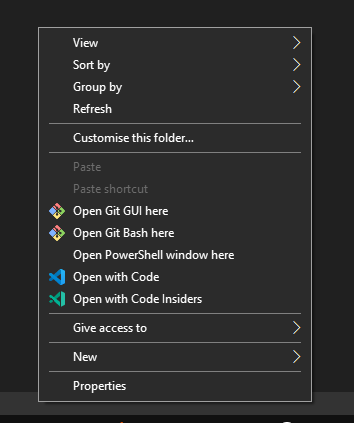
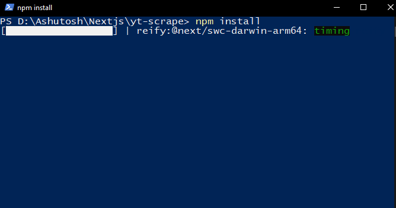
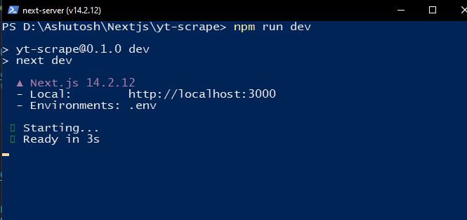

# YouTube Video/Playlist/Channel Downloader

This project allows users to download YouTube videos, playlists, and entire channels by scraping the necessary data and processing it with FFmpeg. Built using [Next.js](https://nextjs.org/), it provides an easy-to-use interface for YouTube content downloads.

## Features

- Download individual YouTube videos.
- Download entire playlists or channels.
- Set custom search terms for targeted video retrieval.
- Specify a destination folder for downloads.

# Setup

## Install [Node.js](https://nodejs.org/en/download/)

- [Visit the official Node.js website](https://nodejs.org/en/) for download and installation instructions.
- Download the latest **LTS (Long Term Support)** version for Windows, macOS, or Linux.

### Run the Installer:

1. Once downloaded, run the `.msi` installer.
2. Follow the setup instructions, making sure the "Add to PATH" option is checked during installation.

### Verify Installation:

- Open **Command Prompt** or **PowerShell**.
- Run the following commands to verify the Node.js and npm (Node Package Manager) installation:

```bash
node -v
npm -v
```

## Install MongoDB

### Download MongoDB:

- Visit the official MongoDB website: [MongoDB Community Server](https://www.mongodb.com/try/download/community).
- Choose the latest **MongoDB Community Server** version for Windows.

### Run the Installer:

1. Download the `.msi` installer and run it.
2. Select **Complete Setup**.
3. Choose **"Run MongoDB as a Service"** for automatic startup.
4. Ensure **"Install MongoDB Compass"** is selected if you want a GUI for managing databases.

---

### Install Project Dependencies

To get started with the project, follow these steps to install dependencies:

```bash
npm install
```

## FFmpeg Setup

<!-- windows user - download ffmpeg package and extract it in c drive or any other location and set it in PATH  -->

### Windows

1. Download the [FFmpeg package](https://ffmpeg.org/download.html) for Windows.
2. Extract the contents to `C:\ffmpeg` or another directory of your choice.
3. Add `C:\ffmpeg\bin` to your `PATH` environment variable:
   - Right-click `This PC` > `Properties`.
   - Click `Advanced system settings`.
   - Under `System Properties`, go to `Environment Variables`.
   - Find `PATH` in the list and click `Edit`.
   - Add the path to the `bin` folder where you extracted FFmpeg (e.g., `C:\ffmpeg\bin`).

### Linux

Install FFmpeg with the following command:

```bash
sudo apt-get install ffmpeg
```

## Setting up environment variables

<!-- mongodb and api key -->

```
MONGODB_URI = 'mongodb connection string'
GOOGLE_API_KEY=" google api key"
```

## Installation Instructions

1. Clone the GitHub repository [yt-scrapper](https://github.com/Tech-Xposer/yt-scrapper) to your local machine .
2. Open the project directory. Press **Shift** and right-click simultaneously, then click on **Open PowerShell window** or **Open Terminal**.
   
3. Type `npm install` in the terminal. This command will install the necessary packages.
   
4. Run the command `npm run dev` to start the development server.

First, run the development server:

```bash
npm run dev
```



Open [http://localhost:3000](http://localhost:3000) with your browser to see the result.

You can start editing the page by modifying `app/page.js`. The page auto-updates as you edit the file.

This project uses [`next/font`](https://nextjs.org/docs/basic-features/font-optimization) to automatically optimize and load Inter, a custom Google Font.

## Learn More

To learn more about Next.js, take a look at the following resources:

- [Next.js Documentation](https://nextjs.org/docs) - learn about Next.js features and API.
- [Learn Next.js](https://nextjs.org/learn) - an interactive Next.js tutorial.

You can check out [the Next.js GitHub repository](https://github.com/vercel/next.js/) - your feedback and contributions are welcome!

## Deploy on Vercel

The easiest way to deploy your Next.js app is to use the [Vercel Platform](https://vercel.com/new?utm_medium=default-template&filter=next.js&utm_source=create-next-app&utm_campaign=create-next-app-readme) from the creators of Next.js.

Check out our [Next.js deployment documentation](https://nextjs.org/docs/deployment) for more details.

## Created by [Ashutosh Sharma](https://github.com/Tech-Xposer)
